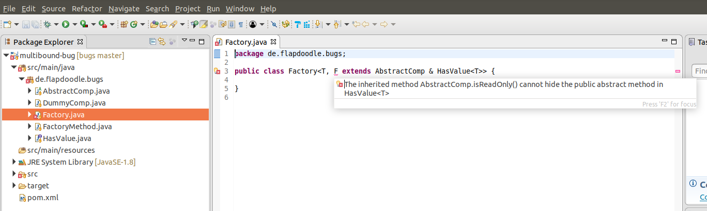

# Multibound Generics Bug

mvn clean install - compiles without any error

eclipse shows following error in class `Factory`

> The inherited method AbstractComp.isReadOnly() cannot hide the public abstract method in HasValue<T>

